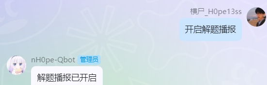
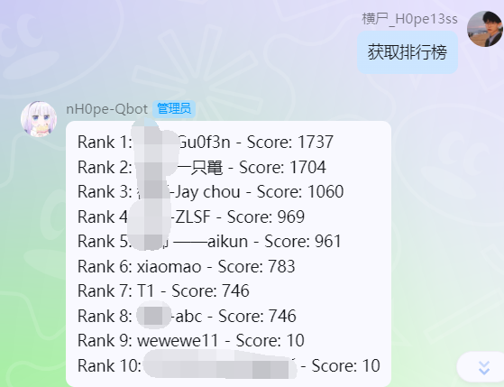

# tuanzi-windows
悲伤，go-cqhttp的时代过去了  
见：https://github.com/Mrs4s/go-cqhttp/issues/2471  
本项目正在准备迁移，截止2023/12/14仍然可以正常使用  
## How to start
本项目需在windows下运行  
安装依赖 `py -3 -m pip install -r requirements.txt`  
其他依赖在whl文件夹中
运行签名服务 双击unidbg-fetch-qsign-onekey中的Start_Qsign.bat即可  
其他配置（欢迎自己研究，我很菜😭😭😭）  
启动机器人 `py -3 bot.py` .
## 使用的插件
### 群管
使用插件[简易群管](https://github.com/yzyyz1387/nonebot_plugin_admin)
在bot.py 导入，语句： nonebot.load_plugin("nonebot_plugin_admin")
#### 鉴黄配置
腾讯云图片安全，开通地址：[https://console.cloud.tencent.com/cms](https://console.cloud.tencent.com/cms)
文档：[https://cloud.tencent.com/document/product/1125](https://cloud.tencent.com/document/product/1125)
需要使用此功能时在 `.env.*` 文件中加入以下内容，并且设置你自己的 `api id` 与 `api key`【不需要此功能可以不配置】
```
# 腾讯云图片安全api
tenid="xxxxxx"
tenkeys="xxxxxx"
# 是否开启禁言等操作的成功提示【不开启的话踢人/禁言等成功没有QQ消息提示】
callback_notice=true # 如果不想开启设置成 false 或者不添加此配置项【默认关闭】
```
详情见大佬仓库  

### hynuctfbot
此插件由我独立开发，二开请注明来源  
适用于gzctf的QQ机器人，由于腾讯的封堵，且用且珍惜
#### 解题播报
QQ对话框输入“开启解题播报”即可，关闭输入“关闭解题播报”  

#### 查看排行榜
QQ对话框输入“获取排行榜”即可  


### 其他  
[nonebot-plugin-imageutils](https://github.com/noneplugin/nonebot-plugin-imageutils)  
[nonebot-plugin-petpet](https://github.com/noneplugin/nonebot-plugin-petpet)  
[nonebot-plugin-apscheduler](https://github.com/nonebot/plugin-apscheduler)  
nonebot-plugin-cloudsignx  
## QQ签名（防止风控）
参考链接：  
https://zhuanlan.zhihu.com/p/648312642  
https://github.com/fuqiuluo/unidbg-fetch-qsign/wiki/%E9%83%A8%E7%BD%B2%E5%9C%A8Windows  
## PS
nH0pe的机器人，目前用于HYNUCTF  
